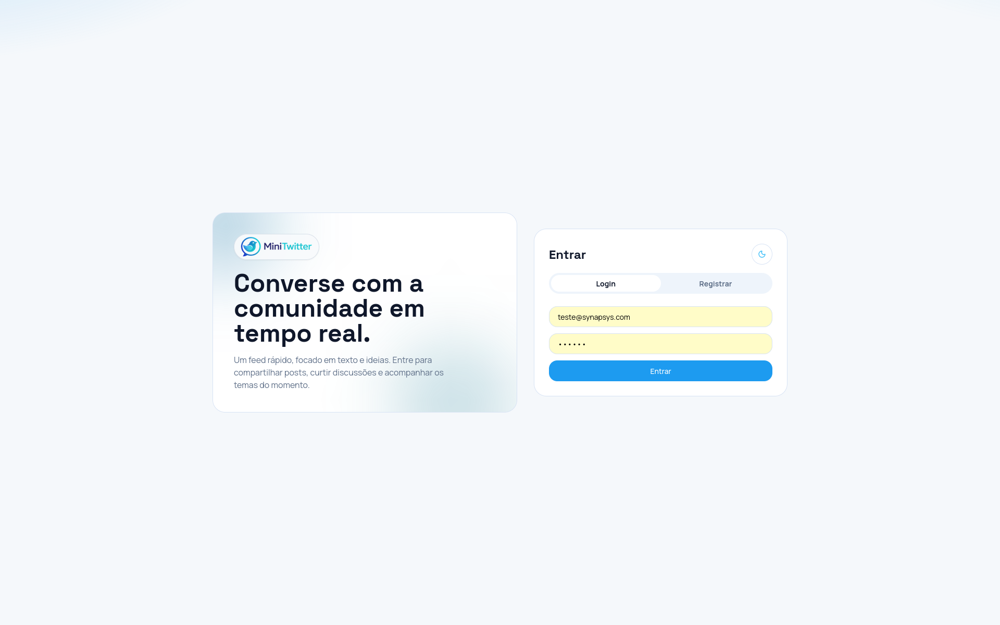
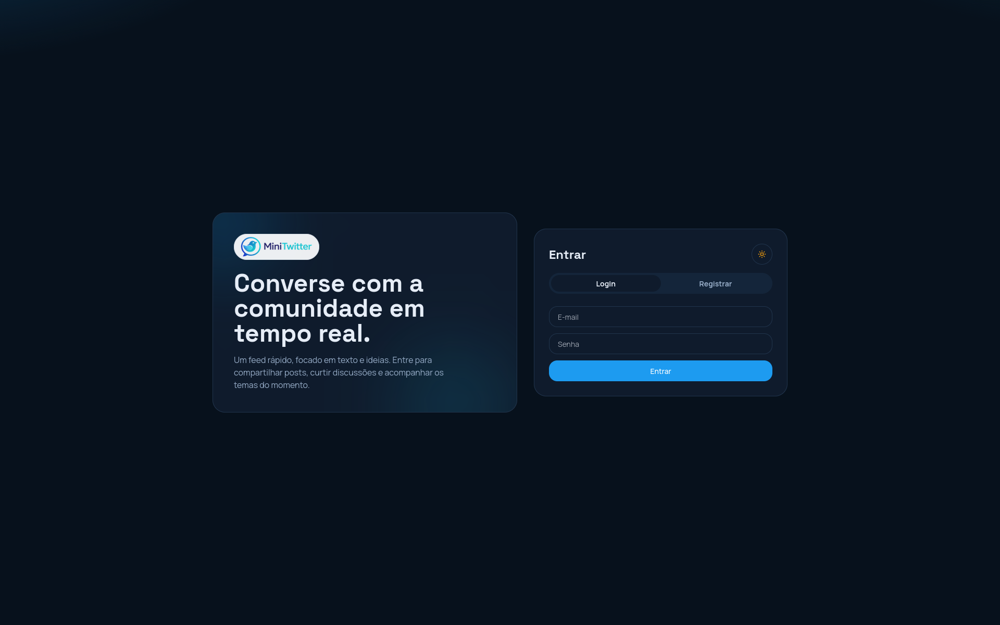
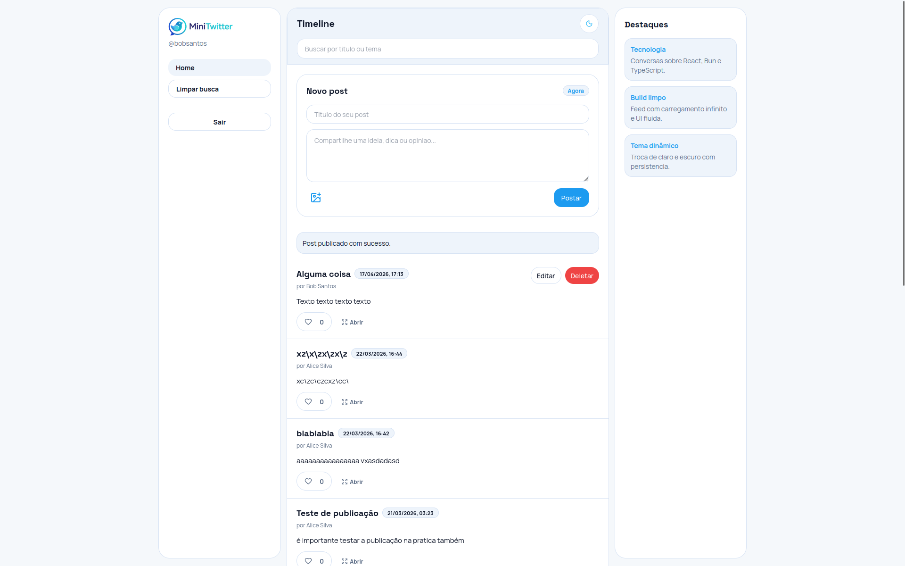
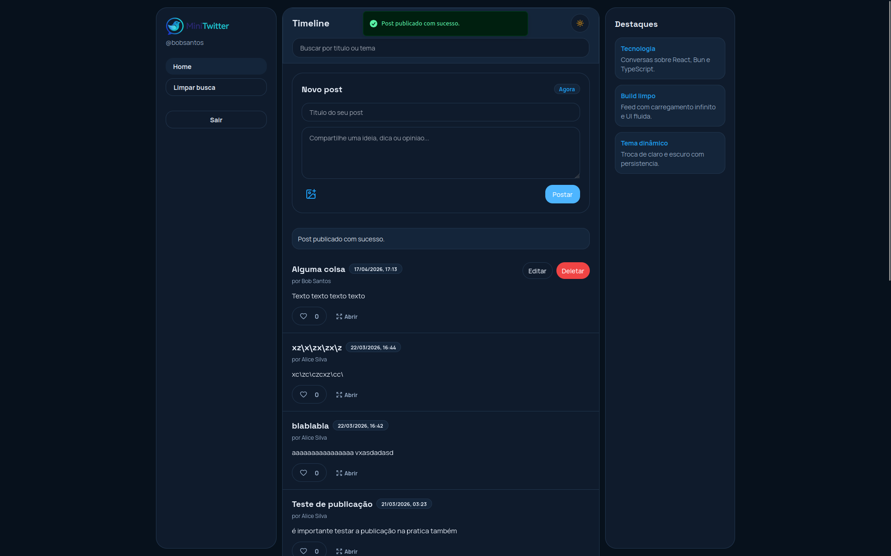

# Mini Twitter

Projeto de rede social em formato microblog, com frontend React e backend Bun/Elysia, permitindo autenticacao, publicacao de posts, interacoes e timeline paginada.

## O que e o projeto

O Mini Twitter e uma aplicacao web para praticar arquitetura fullstack moderna com foco em:

- autenticacao com JWT
- CRUD de posts
- curtidas
- busca e paginacao
- experiencia responsiva
- testes automatizados

## Estrutura do repositorio

```text
teste-dev-frontend/
  docker-compose.yml
  frontend-architecture.md
  mini-twitter-backend-main/
  mini-twitter-frontend-main/
```

## Tecnologias

### Frontend

- React 19
- TypeScript
- Vite
- TanStack Query
- React Hook Form + Zod
- Tailwind CSS
- Sonner

### Backend

- Bun
- Elysia
- SQLite
- JWT

## Funcionalidades principais

- cadastro e login de usuario
- logout com invalidacao de sessao
- timeline de posts
- busca por titulo
- criacao de post com imagem opcional por URL
- edicao e exclusao de posts do proprio autor
- curtida/descurtida de posts
- tema claro/escuro
- menu mobile com animacao deslizante

## Como rodar com Docker

Na raiz do projeto:

```bash
docker compose up --build -d
```

Servicos padrao:

- frontend: `http://localhost:5173`
- backend: `http://localhost:3000`

Para parar:

```bash
docker compose down
```

## Como rodar sem Docker

### Backend

Entrar em `mini-twitter-backend-main` e seguir o README local.

### Frontend

```bash
cd mini-twitter-frontend-main
npm install
npm run dev
```

## Credenciais para teste

Use os usuarios abaixo para testar login no sistema:

- Alice Silva
  - email: `alice@example.com`
  - password: `password123`
- Bob Santos
  - email: `bob@example.com`
  - password: `password123`
- Charlie Oliveira
  - email: `charlie@example.com`
  - password: `password123`

## Imagens do sistema

### Logo do projeto


### Login e timeline por tema

| Tela | Tema claro | Tema escuro |
| --- | --- | --- |
| Login |  |  |
| Timeline |  |  |

## Documentacao

### Frontend (tecnica detalhada)

- `mini-twitter-frontend-main/docs/README.md`
- `mini-twitter-frontend-main/docs/01-visao-geral-frontend.md`
- `mini-twitter-frontend-main/docs/pages/auth-page.md`
- `mini-twitter-frontend-main/docs/pages/timeline-page.md`

### Backend

- `mini-twitter-backend-main/README.md`

## Objetivo educacional

Este repositorio foi estruturado para demonstrar boas praticas de separacao em camadas, validacao de dados, gerenciamento de estado remoto, protecao de rotas e cobertura de testes em projeto fullstack.
