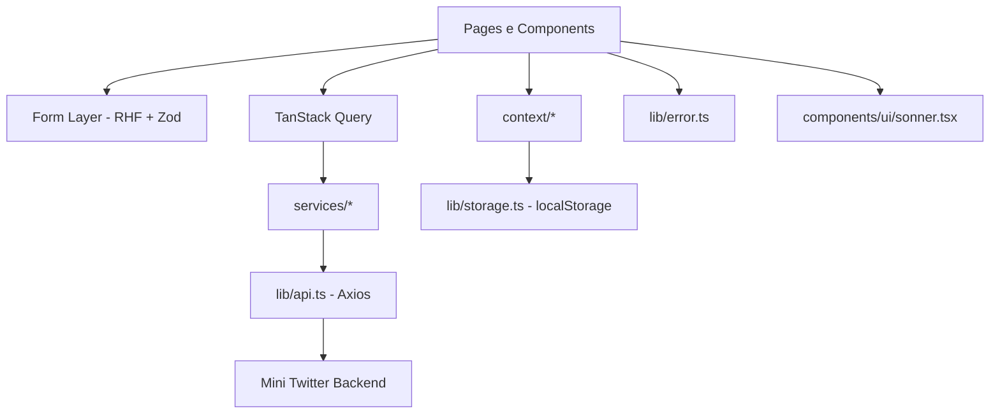
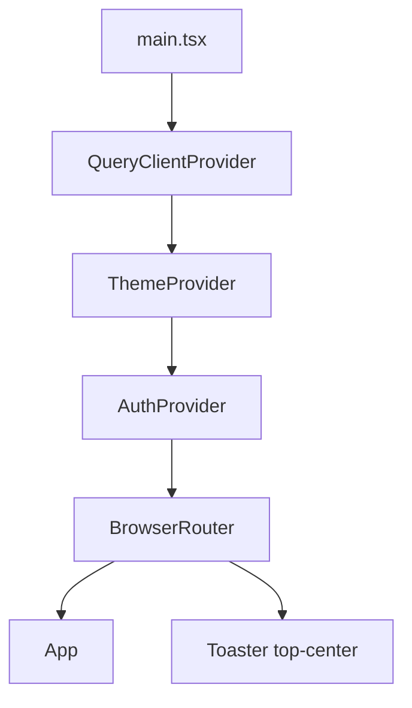
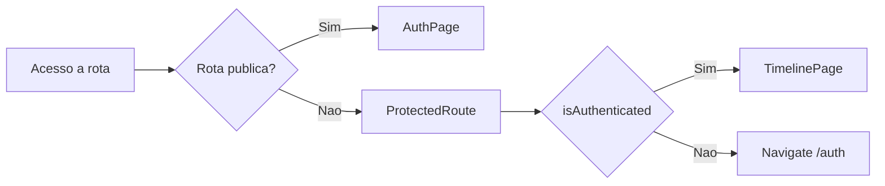
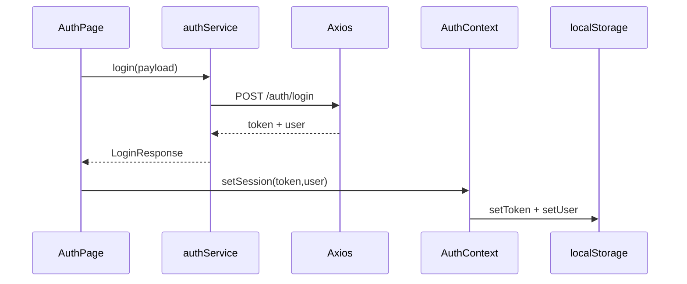

# Visao Geral da Arquitetura Frontend

## 1. Objetivo arquitetural

O frontend foi organizado para separar claramente:

- camada de apresentacao (paginas e componentes)
- camada de estado remoto (TanStack Query)
- camada de integracao HTTP (services + axios)
- camada de estado global/local persistido (contexts + storage)

Essa divisao reduz acoplamento e facilita manutencao de fluxos como login, timeline, mutacoes e tema.

## 2. Stack e papel de cada tecnologia

| Tecnologia | Papel no sistema |
|---|---|
| React 19 | Renderizacao declarativa e composicao de UI |
| TypeScript | Contratos de dados e seguranca de tipos |
| React Router | Definicao de rotas publicas e privadas |
| TanStack Query | Fetch, cache, invalidacao e mutacoes remotas |
| React Hook Form | Controle de formularios |
| Zod | Validacao e mensagens de erro de entrada |
| Axios | Cliente HTTP com interceptor de auth |
| Context API | Sessao de usuario e tema global |
| Tailwind + UI primitives | Estilizacao e consistencia visual |
| sonner | Feedback por toast |

## 3. Arquitetura em camadas

## 4. Runtime de inicializacao

Arquivo: `src/main.tsx`

Ordem de composicao:

1. `QueryClientProvider`
2. `ThemeProvider`
3. `AuthProvider`
4. `BrowserRouter`
5. `App`
6. `Toaster`

## 5. Navegacao e fronteira de acesso

- `App.tsx` define `AuthPage` como rota publica.
- `ProtectedRoute` protege `/` e `/timeline`.
- Usuario sem token e redirecionado para `/auth`.

## 6. Modelo de dados principal

Arquivo: `src/types/api.ts`

- Auth:
  - `User`
  - `LoginResponse`
  - `LoginPayload`
  - `RegisterPayload`
- Posts:
  - `PostItem`
  - `PostPayload`
  - `PostsResponse`

## 7. Contratos HTTP consumidos

| Dominio | Metodo | Endpoint | Uso principal no frontend |
|---|---|---|---|
| Auth | POST | `/auth/register` | Cadastro |
| Auth | POST | `/auth/login` | Login e criacao de sessao |
| Auth | POST | `/auth/logout` | Encerrar sessao |
| Posts | GET | `/posts?page=&search=` | Timeline paginada e busca |
| Posts | POST | `/posts` | Criar post |
| Posts | PUT | `/posts/:id` | Editar post proprio |
| Posts | DELETE | `/posts/:id` | Excluir post proprio |
| Posts | POST | `/posts/:id/like` | Toggle like |

## 8. Estado da aplicacao

### 8.1 Estado local (component state)

- Exemplo: `search`, `expandedPostId`, `mobileMenuOpen`, `mode`.

### 8.2 Estado remoto (query/mutation)

- Timeline e mutacoes com TanStack Query.
- Atualizacao otimista no like.
- Invalidacao de cache para sincronizar feed apos mutacoes.

### 8.3 Estado persistido

- `token` e `user` em `localStorage` via `lib/storage.ts`.
- tema `light/dark` persistido no `ThemeContext`.

## 9. Ciclo de dados de autenticacao

## 10. Estrategia de erro e feedback

- `getApiError` traduz erro HTTP para texto amigavel.
- `toast.success` para sucesso de login, cadastro e postagem.
- mensagens inline para certos cenarios de falha.

## 11. Responsividade

- Timeline desktop em 3 colunas.
- Drawer lateral mobile para acoes de navegacao e logout.
- Modal de post expandido com overlay.

## 12. Testabilidade

Estrutura de testes em `src/**/__tests__/*` cobre:

- paginas
- componentes
- contexts
- services
- libs
- schemas

Essa distribuicao permite detectar regressao por camada, nao apenas por tela.

## 13. Riscos tecnicos conhecidos e mitigacao

| Risco | Impacto | Mitigacao atual |
|---|---|---|
| Drift de contrato API | Erros de runtime | Tipos centralizados em `types/api.ts` + testes de services |
| Estado de sessao inconsistente | Bloqueio de fluxo | `AuthContext` como fonte unica de sessao |
| Cache desatualizado apos mutacao | UI divergente | `invalidateQueries` + update otimista em like |
| Erro silencioso de rede | UX confusa | `getApiError` + mensagens/tosts |
