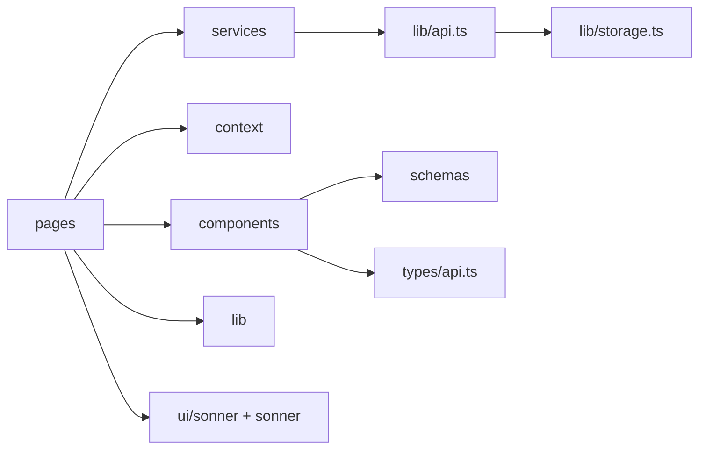
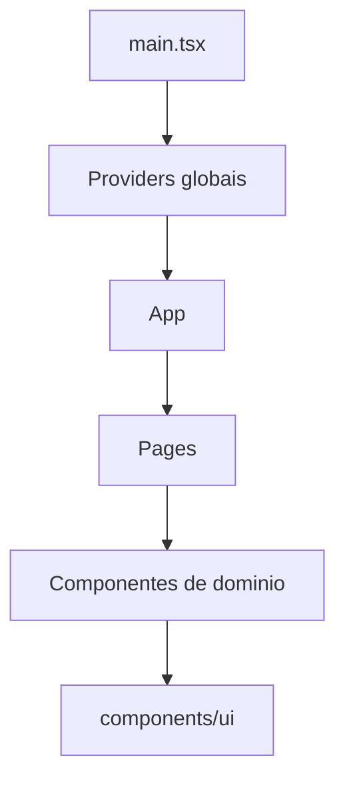

# Componentes Compartilhados, Contextos e Infra

Este documento descreve os blocos reutilizaveis e infraestrutura transversal do frontend.

## 1. Componentes compartilhados

### 1.1 `ProtectedRoute`

Arquivo: `src/components/ProtectedRoute.tsx`

Responsabilidade:

- aplicar politica de acesso para rotas privadas

Contrato funcional:

- entrada: estado de auth via `useAuth`
- saida:
  - autenticado -> renderiza `Outlet`
  - nao autenticado -> `Navigate('/auth')`

### 1.2 `ThemeToggleButton`

Arquivo: `src/components/ThemeToggleButton.tsx`

Responsabilidade:

- alternar tema visual global

Detalhes:

- usa `useTheme` para ler `theme` atual e acao `toggleTheme`
- exibe icones `Sun` e `Moon` com transicao
- fornece `aria-label` contextual para acessibilidade

### 1.3 `PostComposer`

Arquivo: `src/components/PostComposer.tsx`

Responsabilidade:

- compor e validar payload de novo post

Entradas:

- `onSubmitPost(payload)`
- `loading`

Comportamento:

- valida com `postSchema`
- reseta formulario em sucesso
- alterna campo opcional de imagem

### 1.4 `PostCard`

Arquivo: `src/components/PostCard.tsx`

Responsabilidade:

- renderizar item do feed com interacoes

Capacidades:

- visualizacao padrao
- edicao inline
- exclusao (se owner)
- curtir/descurtir
- abrir detalhe

Entradas relevantes:

- `post`, `currentUser`, `liked`, `canInteract`
- callbacks de update/delete/like/open

## 2. Contextos globais

### 2.1 `AuthContext`

Arquivo: `src/context/AuthContext.tsx`

Estado exposto:

- `token`
- `user`
- `isAuthenticated`

Acoes:

- `setSession(token, user)`
- `clearSession()`

Persistencia:

- delega para `lib/storage.ts`

### 2.2 `ThemeContext`

Arquivo: `src/context/ThemeContext.tsx`

Estado exposto:

- `theme`

Acao:

- `toggleTheme()`

Efeitos:

- atualiza `localStorage`
- atualiza `class` e `dataset` em `document.documentElement`

## 3. Camada de dados e utilitarios

### 3.1 `api` (Axios)

Arquivo: `src/lib/api.ts`

Funcoes:

- configurar `baseURL` por ambiente
- injetar `Authorization` via interceptor

### 3.2 `storage`

Arquivo: `src/lib/storage.ts`

Responsabilidade:

- encapsular leitura/escrita de sessao no browser

Chaves padrao:

- `mini-twitter-token`
- `mini-twitter-user`

### 3.3 `getApiError`

Arquivo: `src/lib/error.ts`

Responsabilidade:

- normalizar erro de axios para string amigavel

### 3.4 `Toaster` customizado

Arquivo: `src/components/ui/sonner.tsx`

Responsabilidade:

- integrar `sonner` ao sistema de tema e tokens de design

## 4. Services de dominio

### 4.1 `authService`

Arquivo: `src/services/auth.service.ts`

- `register(payload)`
- `login(payload)`
- `logout()`

### 4.2 `postService`

Arquivo: `src/services/post.service.ts`

- `list(page, search)`
- `create(payload)`
- `update(postId, payload)`
- `delete(postId)`
- `like(postId)`

## 5. Schemas e tipos

### 5.1 Schemas (`zod`)

- `src/schemas/auth.ts`
- `src/schemas/post.ts`

### 5.2 Tipos da API

Arquivo: `src/types/api.ts`

Tipos centrais:

- `User`
- `LoginResponse`
- `PostItem`
- `PostsResponse`
- `PostPayload`

## 6. Dependencia tecnica entre modulos

## 7. "Heranca" em React (composicao)

## 8. Regras de governanca para evolucao

1. Tipos de API devem ser a fonte unica de contrato.
2. Toda alteracao de endpoint precisa atualizar service + testes + docs.
3. Contextos devem continuar pequenos e focados (auth e tema).
4. Nova feature de dominio deve entrar por componentes reutilizaveis antes de ir para pagina.
