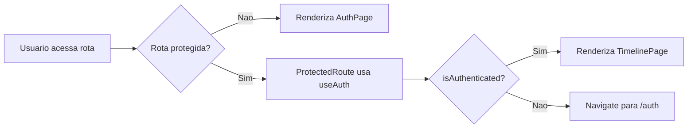
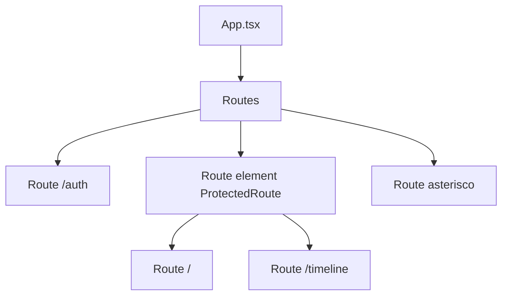
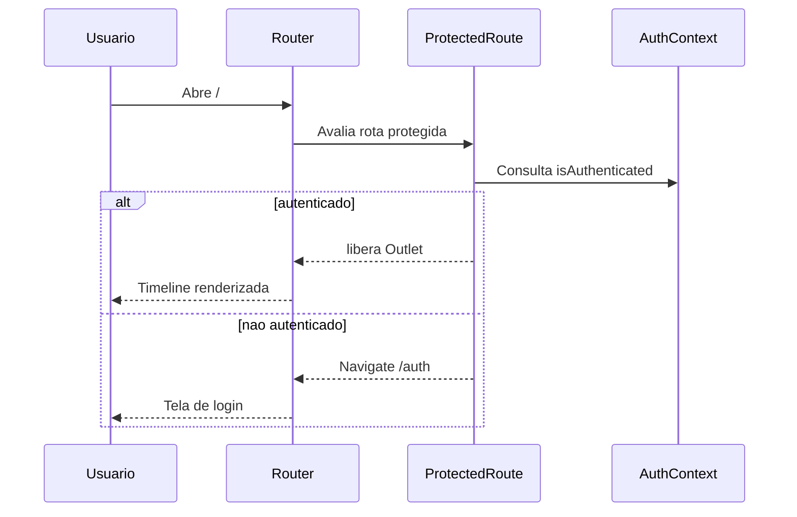

# Pagina Tecnica - App e Roteamento

Arquivo base: `src/App.tsx`

## 1. Objetivo

`App.tsx` define o contrato de navegacao da aplicacao e garante que paginas sensiveis (timeline) fiquem atras de guarda de autenticacao.

## 2. Matriz de rotas

| Path | Tipo | Elemento | Comportamento |
|---|---|---|---|
| `/auth` | Publica | `AuthPage` | Permite login e cadastro |
| `/` | Protegida | `TimelinePage` | Exige sessao valida |
| `/timeline` | Protegida | `TimelinePage` | Alias explicito da timeline |
| `*` | Fallback | `Navigate` para `/` | Centraliza entrada da aplicacao |

## 3. Como a protecao funciona

- `ProtectedRoute` le `isAuthenticated` de `AuthContext`.
- Sem autenticacao: `Navigate('/auth', replace)`.
- Com autenticacao: libera `Outlet` com as rotas filhas.

## 4. Hierarquia de composicao de rotas

## 5. Fluxo de navegacao de sessao

## 6. Dependencias diretas

- `react-router-dom`: `Routes`, `Route`, `Navigate`
- `components/ProtectedRoute.tsx`
- `pages/AuthPage.tsx`
- `pages/TimelinePage.tsx`

## 7. Cenarios limite

1. Usuario abre URL invalida (`/abc`): fallback redireciona para `/`, que por sua vez e protegido.
2. Usuario sem sessao abre `/timeline`: redirecionado para `/auth`.
3. Usuario com sessao abre `/auth`: permitido hoje (nao ha bloqueio reverso para timeline).

## 8. Decisoes e trade-offs

- Manter `* -> /` simplifica entrada unica, mas acopla fallback ao comportamento da rota raiz.
- Duplicar `/` e `/timeline` para mesma pagina melhora UX (URL curta) sem custo relevante.

## 9. Regras para evolucao

- Nova pagina privada deve ser filha de `ProtectedRoute`.
- Nova pagina publica deve ficar fora do guard.
- Alteracao em sessao/autenticacao deve ser validada com testes de:
  - `src/__tests__/App.test.tsx`
  - `src/components/__tests__/ProtectedRoute.test.tsx`
