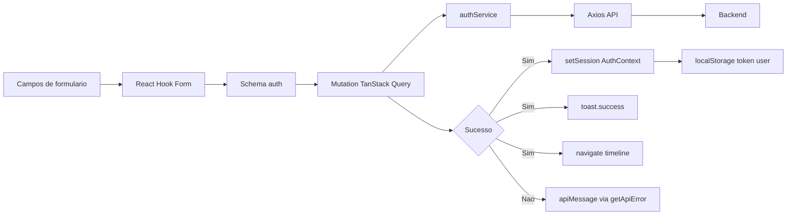
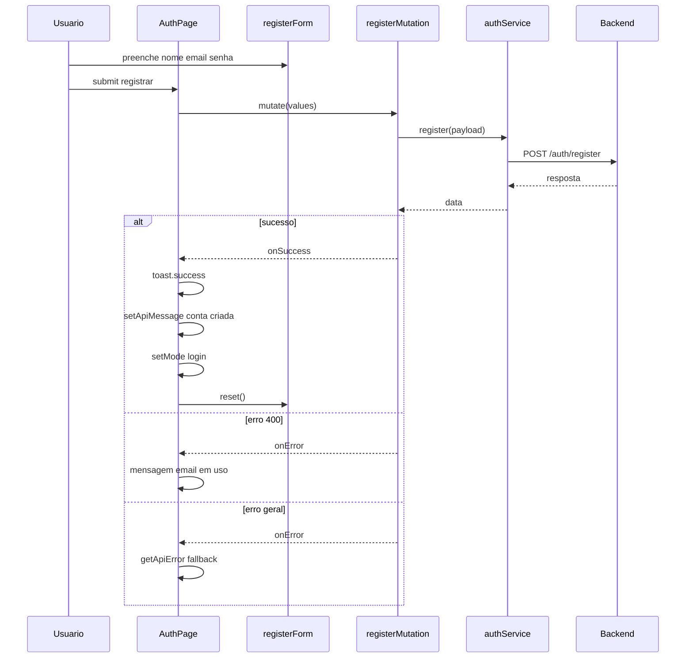
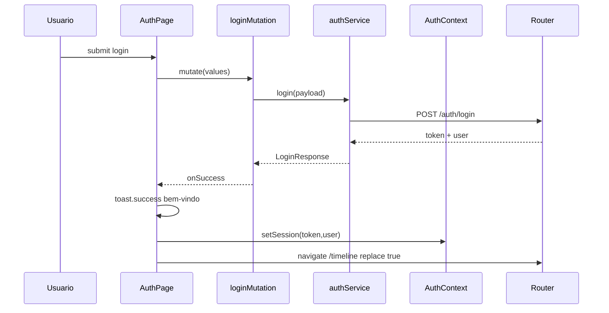
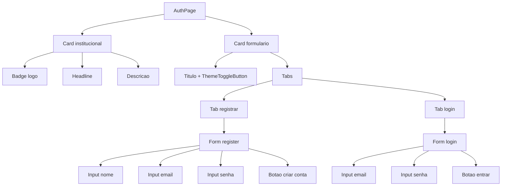

# Pagina Tecnica - AuthPage

Arquivo base: `src/pages/AuthPage.tsx`

## 1. Objetivo

`AuthPage` centraliza autenticacao do usuario com dois fluxos:

- cadastro de conta
- login com criacao de sessao

Em caso de login bem-sucedido, a pagina persiste sessao e redireciona para timeline.

## 2. Responsabilidades funcionais

1. Renderizar layout institucional da landing de autenticacao.
2. Exibir logo e area de branding.
3. Controlar alternancia de abas (`login` e `register`).
4. Validar entradas com schemas Zod.
5. Executar mutacoes de auth e tratar estados de pending/success/error.
6. Mostrar feedback por toast e mensagem textual.
7. Criar sessao (`token` + `user`) via `AuthContext` no login.

## 3. Dependencias tecnicas

| Categoria | Modulos |
|---|---|
| Formulario | `react-hook-form`, `zodResolver`, `schemas/auth.ts` |
| Dados remotos | `useMutation` (`@tanstack/react-query`) |
| Integracao auth | `services/auth.service.ts` |
| Sessao global | `context/AuthContext.tsx` |
| Navegacao | `useNavigate` (`react-router-dom`) |
| UI | `Card`, `Input`, `Button`, `Tabs`, `Badge`, `ThemeToggleButton` |
| Erro/feedback | `getApiError`, `toast` (`sonner`) |

## 4. Estado interno da pagina

| Estado | Tipo | Funcao |
|---|---|---|
| `mode` | `"login" | "register"` | controla aba ativa |
| `apiMessage` | `string` | mensagem textual de retorno para usuario |

## 5. Form schemas e regras

Arquivo: `src/schemas/auth.ts`

- Cadastro:
  - `name` minimo 2
  - `email` valido
  - `password` minimo 4
- Login:
  - `email` valido
  - `password` obrigatoria

## 6. Fluxo de dados de alto nivel

## 7. Fluxo detalhado - Cadastro

## 8. Fluxo detalhado - Login

## 9. Composicao de componentes

## 10. Estrategia de erro

| Fluxo | Condicao | Comportamento |
|---|---|---|
| Cadastro | HTTP 400 | mensagem especifica de email em uso |
| Cadastro | Outros erros | `getApiError` com fallback |
| Login | Erro geral | `getApiError` com fallback credenciais |

## 11. Contratos de entrada e saida

- Entrada registro: `RegisterPayload`
- Entrada login: `LoginPayload`
- Saida login: `LoginResponse`

## 12. Checklist para manutencao

1. Alterou schema de auth? Atualize `schemas/auth.ts` + testes.
2. Alterou endpoint de auth? Atualize `services/auth.service.ts` + docs.
3. Alterou formato de `LoginResponse`? Atualize `types/api.ts` + `AuthContext`.
4. Alterou feedback de usuario? Revalidar `toast` e `apiMessage`.

## 13. Testes relacionados

- `src/pages/__tests__/AuthPage.test.tsx`
- `src/schemas/__tests__/auth.test.ts`
- `src/services/__tests__/auth.service.test.ts`
- `src/context/__tests__/AuthContext.test.tsx`
