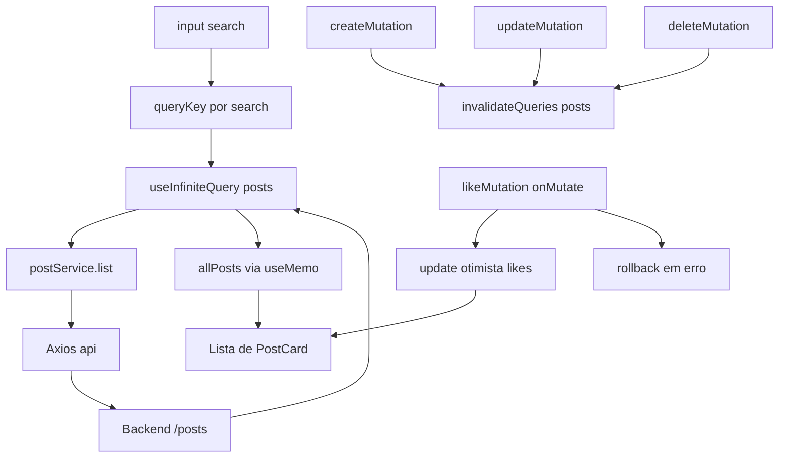
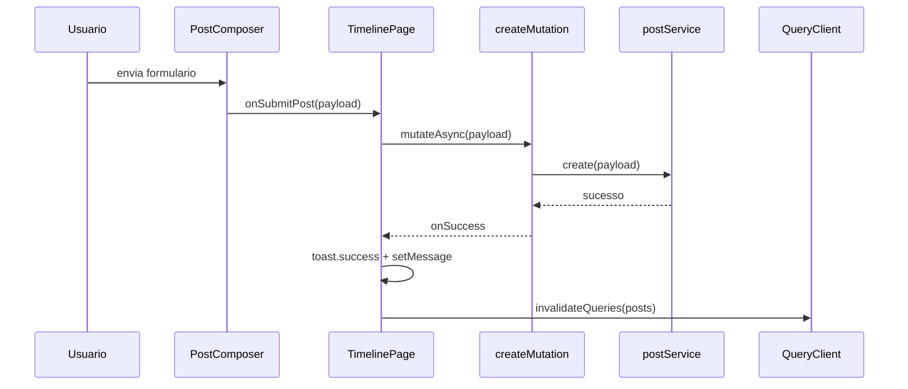
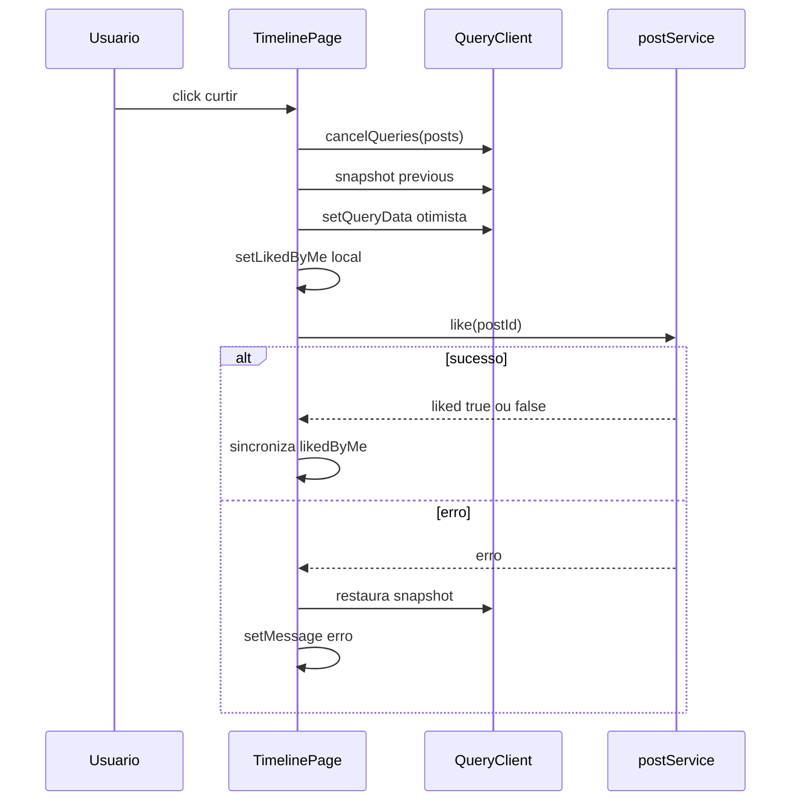
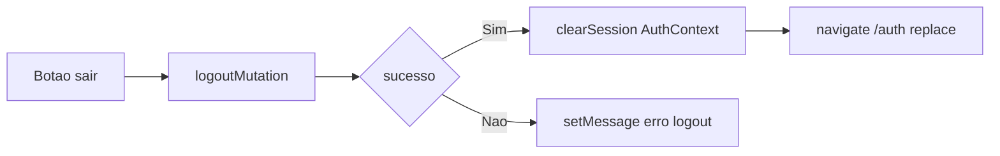
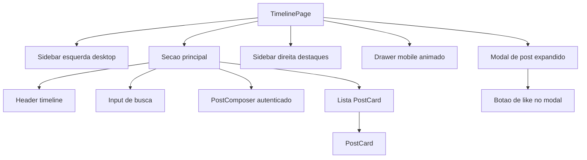

# Pagina Tecnica - TimelinePage

Arquivo base: `src/pages/TimelinePage.tsx`

## 1. Objetivo

`TimelinePage` e o centro funcional da aplicacao. Ela combina:

- leitura de feed paginado
- busca
- criacao/edicao/exclusao
- curtida com otimizacao
- logout e navegacao
- experiencia desktop e mobile

## 2. Responsabilidades funcionais

1. Carregar e renderizar posts paginados.
2. Reagir a busca por titulo (`search`).
3. Permitir criar post (autenticado).
4. Permitir editar/deletar post do proprio autor.
5. Permitir curtir/descurtir com update otimista.
6. Exibir modal detalhado do post.
7. Controlar menu lateral mobile com animacao.
8. Encerrar sessao via logout.

## 3. Estados locais e sua finalidade

| Estado | Tipo | Responsabilidade |
|---|---|---|
| `search` | `string` | termo de busca usado no `queryKey` |
| `message` | `string` | feedback textual inline |
| `likedByMe` | `Record<number, boolean>` | estado local de curtidas por post |
| `expandedPostId` | `number \| null` | controla modal de detalhe |
| `mobileMenuOpen` | `boolean` | abre/fecha drawer mobile |

## 4. Dependencias principais

| Categoria | Modulos |
|---|---|
| Query/Mutation | `useInfiniteQuery`, `useMutation`, `useQueryClient` |
| Servicos | `postService`, `authService` |
| Contexto | `useAuth` |
| Componentes | `PostComposer`, `PostCard`, `ThemeToggleButton` |
| Utilitarios | `getApiError`, `toast` |
| Icones | `Heart`, `Menu`, `X` |

## 5. Modelo de dados consumido

- Entrada principal: `PostsResponse`
- Lista renderizada: `PostItem[]`
- Mutacoes usam `PostPayload`/`PostSchema`
- Like retorna `{ liked: boolean }`

## 6. Estrategia de query e cache

### Query base

- `queryKey(search) => ['posts', search]`
- `queryFn`: `postService.list(pageParam, search)`
- `getNextPageParam`: calculado por `total` e `limit`

### Comportamento de invalidacao

- `createMutation`: invalida `['posts']`
- `updateMutation`: invalida `['posts']`
- `deleteMutation`: invalida `['posts']`

### Otimizacao de like

- `onMutate`:
  - cancela queries
  - gera snapshot
  - aplica update otimista de `likesCount`
- `onError`:
  - rollback para snapshot

## 7. Fluxo de dados - leitura e interacao

## 8. Fluxo detalhado - criacao de post

## 9. Fluxo detalhado - like otimista

## 10. Fluxo de logout

## 11. Composicao de componentes

## 12. Regras de permissao

- Sem autenticacao:
  - nao pode criar, editar, deletar, curtir
  - recebe CTA para login
- Com autenticacao:
  - pode interagir
  - so autor pode editar/deletar

## 13. Responsividade

### Desktop

- 3 colunas em grade
- sidebar de navegacao fixa
- painel de destaques fixo em telas grandes

### Mobile

- botao `Abrir menu` no header
- drawer lateral com overlay
- animacao de abertura simulando painel "abrindo" (slide, opacity e blur)

## 14. Tratamento de erro por mutacao

| Mutacao | Tratamento |
|---|---|
| Criar | `getApiError` + mensagem |
| Editar | `403` especifico + fallback |
| Deletar | `403` especifico + fallback |
| Curtir | rollback otimista + mensagem |
| Logout | mensagem de falha |

## 15. Checklist de manutencao

1. Alterou pagina ou limite do backend? revisar `getNextPageParam`.
2. Alterou contrato de post? revisar `types/api.ts`, `post.service.ts` e `PostCard`.
3. Alterou like endpoint? revisar mutacao otimista e rollback.
4. Alterou menu mobile? validar acessibilidade (`aria-label`) e testes.

## 16. Testes relacionados

- `src/pages/__tests__/TimelinePage.test.tsx`
- `src/components/__tests__/PostCard.test.tsx`
- `src/components/__tests__/PostComposer.test.tsx`
- `src/services/__tests__/post.service.test.ts`
